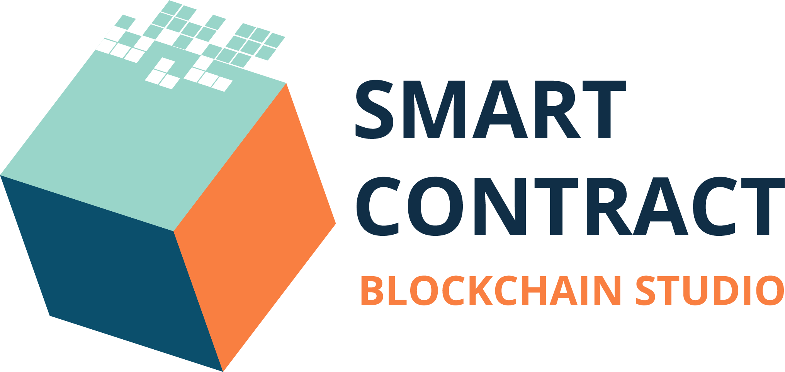
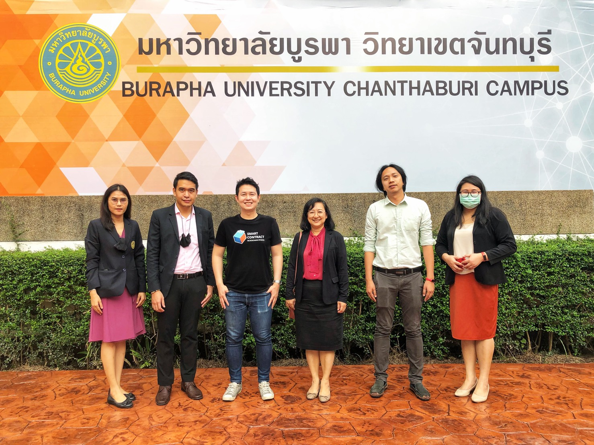

## Blockchain in Logistics and Supply Chain. [#OperationBUU](https://www.facebook.com/hashtag/OperationBUU)

+ Date : (Thu) November 15, 2020
+ Venue : [Faculty of Science and Arts, BUU (Chanthaburi)](http://scia.chanthaburi.buu.ac.th/)

[](https://www.facebook.com/hashtag/OperationBUU)

## Contributor[s]
+ Sathapon Patanakuha (สถาพน พัฒนะคูหา) [Operation Enabler] [[➳](https://web.facebook.com/banksathapon)]
+ Maykin Warasart (เมฆินทร์ วรศาสตร์) [Operation Leader] [[➳](http://mk.in.th)]
+ Piyaporn Rattanopat (ปิยาภรณ์ รัตโนภาส) [[Cert](OperationBUU/contributor/VXOpBUU-20201015-Piyaporn-Rattanopat.pdf)]
+ Luksamon Boonma (ลักษมณ บุญมา) [[Cert](OperationBUU/contributor/VXOpBUU-20201015-Luksamon-Boonma.pdf)]

## Operation Co-ordinator
+ Pattira Namkate (ภัททิรา นามเกตุ) [[➳](https://www.facebook.com/baitoeyJa)]

## Operation Facilitator
+ Thutchanan Sangwan (อ.ธัชนันท์ สังวาลย์) [[➳](https://www.facebook.com/thutchanan.sangwan)]

## Official Sponsor
[](https://www.smartcontractthailand.com/)

## Attendees
<!--  [[Cert](OperationBUU/attendance/xxx.pdf)] -->
1. Amonrat Satkuson (อมรรัตน์ สัตย์กุศล) [[Cert](OperationBUU/attendance/VXOpBUU-20201015-Amonrat-Satkuson.pdf)]
1. Ananya Bunchaiyo (อนัญญา บุญไชโย) [[Cert](OperationBUU/attendance/VXOpBUU-20201015-Ananya-Bunchaiyo.pdf)]
1. Anujitra Trajit (อนุจิตรา ไตรจิตร์) [[Cert](OperationBUU/attendance/VXOpBUU-20201015-Anujitra-Trajit.pdf)]
1. Apatsara Pakkatae (อภัสรา ปักกะเต) [[Cert](OperationBUU/attendance/VXOpBUU-20201015-Apatsara-Pakkatae.pdf)]
1. Apichada Seangjan (อภิชาดา แสงจันทร์) [[Cert](OperationBUU/attendance/VXOpBUU-20201015-Apichada-Seangjan.pdf)]
1. Apisit Chamnan (อภิสิทธิ์ ชำนาญ) [[Cert](OperationBUU/attendance/VXOpBUU-20201015-Apisit-Chamnan.pdf)]
1. Apiwat Sarajittapap (อภิวัฒน์ สารจิตตาภาพ) [[Cert](OperationBUU/attendance/VXOpBUU-20201015-Apiwat-Sarajittapap.pdf)]
1. Areeya Mayeng (อารีญา มะเย็ง) [[Cert](OperationBUU/attendance/VXOpBUU-20201015-Areeya-Mayeng.pdf)]
1. Athitaya Sinpasit (อฐิตญา ศิลปสิทธิ์) [[Cert](OperationBUU/attendance/VXOpBUU-20201015-Athitaya-Sinpasit.pdf)]
1. Chalinee Funglo (ชาลิณี ฟุ้งโล้) [[Cert](OperationBUU/attendance/VXOpBUU-20201015-Chalinee-Funglo.pdf)]
1. Chalita Pimthong (ชลิตา พิมทอง) [[Cert](OperationBUU/attendance/VXOpBUU-20201015-Chalita-Pimthong.pdf)]
1. Chanayut Pimkot (ชนายุทธ พิมพ์คต) [[Cert](OperationBUU/attendance/VXOpBUU-20201015-Chanayut-Pimkot.pdf)]
1. Chirawan Poldechdecha (จิราวรรณ พลเดชเดชา) [[Cert](OperationBUU/attendance/VXOpBUU-20201015-Chirawan-Poldechdecha.pdf)]
1. Chutimon Wattanachaiworkun (ชุติมณฑน์ วัฒนาชัยวรกุล) [[Cert](OperationBUU/attendance/VXOpBUU-20201015-Chutimon-Wattanachaiworkun.pdf)]
1. Duanghathai Khamphuet (ดวงหทัย คำพืช) [[Cert](OperationBUU/attendance/VXOpBUU-20201015-Duanghathai-Khamphuet.pdf)]
1. Jarupicha Apichart (จารุพิชา อภิชาติ) [[Cert](OperationBUU/attendance/VXOpBUU-20201015-Jarupicha-Apichart.pdf)]
1. Jiraphat Malanit (จิรภัทร์ มาลานิตย์) [[Cert](OperationBUU/attendance/VXOpBUU-20201015-Jiraphat-Malanit.pdf)]
1. Jiraphon Praparn (จิราภรณ์ ประพาฬ) [[Cert](OperationBUU/attendance/VXOpBUU-20201015-Jiraphon-Praparn.pdf)]
1. Jittarin Tupanna (จิตตริน ตุปันนา) [[Cert](OperationBUU/attendance/VXOpBUU-20201015-Jittarin-Tupanna.pdf)]
1. Kamonsri Narapong (กมลศรี นราพงค์) [[Cert](OperationBUU/attendance/VXOpBUU-20201015-Kamonsri-Narapong.pdf)]
1. Kanokporn Magthapwong (กนกพร มากเทพวงษ์) [[Cert](OperationBUU/attendance/VXOpBUU-20201015-Kanokporn-Magthapwong.pdf)]
1. Kotchakorn Bumrung (กชกร บำรุง) [[Cert](OperationBUU/attendance/VXOpBUU-20201015-Kotchakorn-Bumrung.pdf)]
1. Kittiwadee Prempree (กิตติวดี เปรมปรีดิ์) [[Cert](OperationBUU/attendance/VXOpBUU-20201015-Kittiwadee-Prempree.pdf)]
1. Klinchai Siritrai (คลินชัย ศิริตรัย) [[Cert](OperationBUU/attendance/VXOpBUU-20201015-Klinchai-Siritrai.pdf)]
1. Mingkomut Phitpheng (มิ่งโกมุท พิศเพ็ง) [[Cert](OperationBUU/attendance/VXOpBUU-20201015-Mingkomut-Phitpheng.pdf)]
1. Montira Wongmuang (มณธิรา วงศ์เมือง) [[Cert](OperationBUU/attendance/VXOpBUU-20201015-Montira-Wongmuang.pdf)]
1. Napatsorn Phucharoen (นภัสสร ภูเจริญ) [[Cert](OperationBUU/attendance/VXOpBUU-20201015-Napatsorn-Phucharoen.pdf)]
1. Natcha Sutatham (ณัชชา สุตาธรรม) [[Cert](OperationBUU/attendance/VXOpBUU-20201015-Natcha-Sutatham.pdf)]
1. Natikorn Keawkliang (เนติกร แก้วเกลี้ยง) [[Cert](OperationBUU/attendance/VXOpBUU-20201015-Natikorn-Keawkliang.pdf)]
1. Nichapat Sawhangrojn (ณิชาภัชร สว่างโรจน์) [[Cert](OperationBUU/attendance/VXOpBUU-20201015-Nichapat-Sawhangrojn.pdf)]
1. Nitit Mamen (นิธิศ มาเม่น) [[Cert](OperationBUU/attendance/VXOpBUU-20201015-Nitit-Mamen.pdf)]
1. Nopparut Thikhampornsan (นพรุจ ทิฆัมพรศานต์) [[Cert](OperationBUU/attendance/VXOpBUU-20201015-Nopparut-Thikhampornsan.pdf)]
1. Noppong Faekhom (ณพพงศ์ แฝกหอม) [[Cert](OperationBUU/attendance/VXOpBUU-20201015-Noppong-Faekhom.pdf)]
1. Nutchaphon Pungamaharporn (ณัชพล ปัญจมหาพร) [[Cert](OperationBUU/attendance/VXOpBUU-20201015-Nutchaphon-Pungamaharporn.pdf)]
1. Panadda Choowet (ปนัดดา ชูเวชย์) [[Cert](OperationBUU/attendance/VXOpBUU-20201015-Panadda-Choowet.pdf)]
1. Panutchadaporn Karakes (ปนัฐชฎาภร การะเกษ) [[Cert](OperationBUU/attendance/VXOpBUU-20201015-Panutchadaporn-Karakes.pdf)]
1. Pattraporn Naksakul (ภัทราภรณ์ นาคสกุล) [[Cert](OperationBUU/attendance/VXOpBUU-20201015-Pattraporn-Naksakul.pdf)]
1. Pawita Rachpitak (ภาวิตา ราชพิทักษ์) [[Cert](OperationBUU/attendance/VXOpBUU-20201015-Pawita-Rachpitak.pdf)]
1. Penpichcha Ramsoongnoen (เพ็ญพิชชา รำสูงเนิน) [[Cert](OperationBUU/attendance/VXOpBUU-20201015-Penpichcha-Ramsoongnoen.pdf)]
1. Penpisut Moolsarn (เพ็ญพิสุทธิ์ มูลสาร) [[Cert](OperationBUU/attendance/VXOpBUU-20201015-Penpisut-Moolsarn.pdf)]
1. Phattarawadee Aunghuab (ภัทรวดี อึ่งฮวบ) [[Cert](OperationBUU/attendance/VXOpBUU-20201015-Phattarawadee-Aunghuab.pdf)]
1. Phattharanan Arunchot (ภัทรนันท์ อรัญโชติ) [[Cert](OperationBUU/attendance/VXOpBUU-20201015-Phattharanan-Arunchot.pdf)]
1. Phattharasuda Boonnalai (ภัทรสุดา บุญณลัย) [[Cert](OperationBUU/attendance/VXOpBUU-20201015-Phattharasuda-Boonnalai.pdf)]
1. Plaifah Horklong (ปรายฟ้า หอกลอง) [[Cert](OperationBUU/attendance/VXOpBUU-20201015-Plaifah-Horklong.pdf)]
1. Possachon Boocha (พสชนน์ บูชา) [[Cert](OperationBUU/attendance/VXOpBUU-20201015-Possachon-Boocha.pdf)]
1. Prapaporn Buathalai (ประภาพร บัวไถล) [[Cert](OperationBUU/attendance/VXOpBUU-20201015-Prapaporn-Buathalai.pdf)]
1. Prapaporn Tongklamsang (ประภาพร ทองกล่ำแสง) [[Cert](OperationBUU/attendance/VXOpBUU-20201015-Prapaporn-Tongklamsang.pdf)]
1. Sanya Wariwan (สัญญา วาริวรรณ์) [[Cert](OperationBUU/attendance/VXOpBUU-20201015-Sanya-Wariwan.pdf)]
1. Sarawut Yimdee (สราวุฒิ ยิ้มดี) [[Cert](OperationBUU/attendance/VXOpBUU-20201015-Sarawut-Yimdee.pdf)]
1. Satreerat Boonyen (สตรีรัตน์ บุญเย็น) [[Cert](OperationBUU/attendance/VXOpBUU-20201015-Satreerat-Boonyen.pdf)]
1. Sirinya Hirunto (สิริญญา หิรัญโท) [[Cert](OperationBUU/attendance/VXOpBUU-20201015-Sirinya-Hirunto.pdf)]
1. Sunantha Aiadwiangsra (สุนันทา เอียดเวียงสระ) [[Cert](OperationBUU/attendance/VXOpBUU-20201015-Sunantha-Aiadwiangsra.pdf)]
1. Suparat Nipaporn (ศุภรัตน์ นิพาพอน) [[Cert](OperationBUU/attendance/VXOpBUU-20201015-Suparat-Nipaporn.pdf)]
1. Supattra Pinyoratanachote (สุภัทรา ภิญโญรัตนโชติ) [[Cert](OperationBUU/attendance/VXOpBUU-20201015-Supattra-Pinyoratanachote.pdf)]
1. Supattra Pirompo (สุพัตรา ภิรมย์โพธ์) [[Cert](OperationBUU/attendance/VXOpBUU-20201015-Supattra-Pirompo.pdf)]
1. Tassanun Kanklang (ทัศนันท์ คานกลาง) [[Cert](OperationBUU/attendance/VXOpBUU-20201015-Tassanun-Kanklang.pdf)]
1. Tawan Laipradit (ตะวัน หลายประดิษฐ์) [[Cert](OperationBUU/attendance/VXOpBUU-20201015-Tawan-Laipradit.pdf)]
1. Thammarart Pongsotorn (ธรรมรัฐ พงโศธร) [[Cert](OperationBUU/attendance/VXOpBUU-20201015-Thammarart-Pongsotorn.pdf)]
1. Thanarat Wanitchanon (ธนรัตน์ วณิชชานนท์) [[Cert](OperationBUU/attendance/VXOpBUU-20201015-Thanarat-Wanitchanon.pdf)]
1. Thiphaporn Phanitattra (ทิพาพร พานิชอัตรา) [[Cert](OperationBUU/attendance/VXOpBUU-20201015-Thiphaporn-Phanitattra.pdf)]
1. Thitikan Saenubon (ฐิติกานต์ แสนอุบล) [[Cert](OperationBUU/attendance/VXOpBUU-20201015-Thitikan-Saenubon.pdf)]
1. Thitima Jangnet (ธิติมา แจ้งเนตร) [[Cert](OperationBUU/attendance/VXOpBUU-20201015-Thitima-Jangnet.pdf)]
1. Treerapat Sirichan (ธีรภัทร ศิริจันทร์) [[Cert](OperationBUU/attendance/VXOpBUU-20201015-Treerapat-Sirichan.pdf)]
1. Tripop Phiananek (ไตรภพ เพียรเอนก) [[Cert](OperationBUU/attendance/VXOpBUU-20201015-Tripop-Phiananek.pdf)]
1. Vilasinee Phanthasen (วิลาสินี พันธเสน) [[Cert](OperationBUU/attendance/VXOpBUU-20201015-Vilasinee-Phanthasen.pdf)]
1. Watcharapon Sanguangpong (วัชรพล สงวนพงษ์) [[Cert](OperationBUU/attendance/VXOpBUU-20201015-Watcharapon-Sanguangpong.pdf)]
1. Watsana Thuram (วาสนา ทุรัมย์) [[Cert](OperationBUU/attendance/VXOpBUU-20201015-Watsana-Thuram.pdf)]
1. Wattanan Udomjareansinchai (วรรธนันท์ อุดมเจริญสินชัย) [[Cert](OperationBUU/attendance/VXOpBUU-20201015-Wattanan-Udomjareansinchai.pdf)]
1. Worawan Yeemarfuang (วรวรรณ ยีแมเฟือง) [[Cert](OperationBUU/attendance/VXOpBUU-20201015-Worawan-Yeemarfuang.pdf)]
1. Yuwadee Pewsamrong (ยุวดี ผิวสำโรง) [[Cert](OperationBUU/attendance/VXOpBUU-20201015-Yuwadee-Pewsamrong.pdf)]
<!--  [[Cert](OperationBUU/attendance/xxx.pdf)] -->

[](https://www.facebook.com/hashtag/OperationBUU)

```markdown
Let's volunteer to make an impact together!
```

## Become a Supporter

[](https://lin.ee/cnIgUj4)

[](https://line.me/R/ti/p/@voluntex)
[](https://m.me/VolunteXTH)
