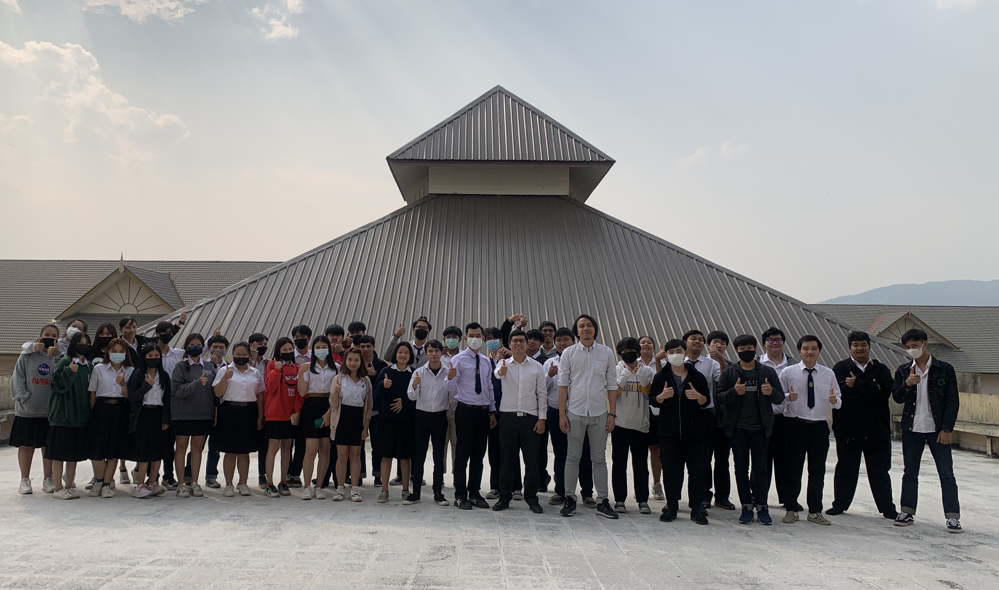
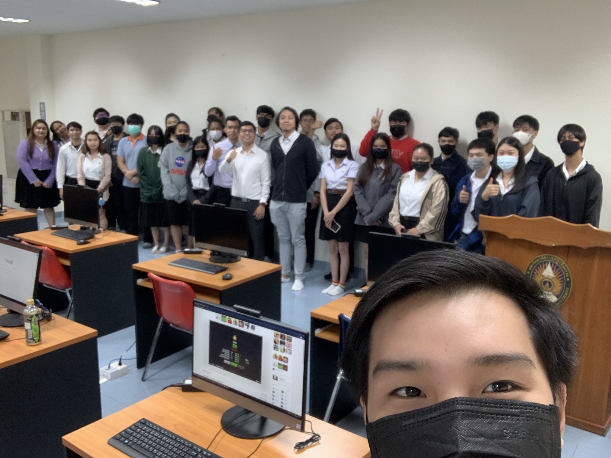
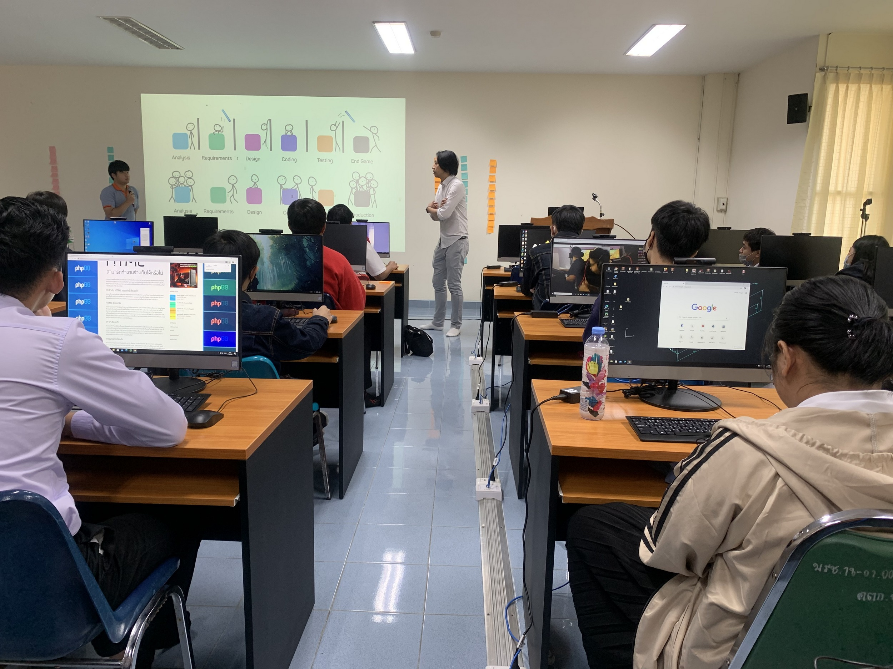

## Secure Software Development Lifecycle (#OperationCRRU)

+ Date : (Sat) February 27, 2021
+ Venue : [School of Computer & IT, Chiang Rai Rajabhat University](https://scit.crru.ac.th/)

[](https://www.facebook.com/hashtag/OperationCRRU)

## Operation Facilitator
+ Dr.Mayoon Yaibuates (มยูร ใยบัวเทศ) [[➳](https://www.facebook.com/iamwon)]

## Contributor
+ Maykin Warasart (เมฆินทร์ วรศาสตร์) [[➳](http://mk.in.th)]

## Attendees
<!--  [[Cert](OperationCRRU/attendance/xxx.pdf)] -->
1. Adithep
1. Anon
1. Aranya
1. Banthita Krajongkaew (บัณฑิตา) [[Cert](OperationCRRU/attendance/VXOpCRRU-20210227-Banthita-Krajongkaew.pdf)]
1. Chaiwat
1. Chattaporn
1. Kittipoom
1. Kittithat
1. Korawit
1. Kunakorn
1. Natpakorn
1. Natthaporn
1. Natthawut Manaohwan (ณัฐวุฒิ มะนาวหวาน) [[Cert](OperationCRRU/attendance/VXOpCRRU-20210227-Natthawut-Manaohwan.pdf)]
1. Ninmanee
1. Nonthawat Yodmeang (นนธวัช ยอดเมือง) [[Cert](OperationCRRU/attendance/VXOpCRRU-20210227-Nonthawat-Yodmeang.pdf)]
1. Nutchanon
1. Pantakan
1. Phanprueksa Janthajaem (พรรพฤษา) [[Cert](OperationCRRU/attendance/VXOpCRRU-20210227-Phanprueksa-Janthajaem.pdf)]
1. Phumin Nantachaiwut (ภูมิน นันตาชัยวุฒิ) [[Cert](OperationCRRU/attendance/VXOpCRRU-20210227-Phumin-Nantachaiwut.pdf)]
1. Pimpisa
1. Pisanu
1. Runglawan
1. Sahawan
1. Sarawut
1. Suphakit
1. Suttita
1. Tan Pumma (ตาล พุ่มมา) [[Cert](OperationCRRU/attendance/VXOpCRRU-20210227-Tan-Pumma.pdf)]
1. Thaksin
1. Thanadol
1. Thidaporn
1. Uthai
1. Wannasiri
1. Waranya
1. Weeraponng


[](https://www.facebook.com/hashtag/OperationCRRU)

[](https://www.facebook.com/hashtag/OperationCRRU)

```markdown
Let's volunteer to make an impact together!
```

## Become a Supporter

[](https://lin.ee/cnIgUj4)

[](https://line.me/R/ti/p/@voluntex)
[](https://m.me/VolunteXTH)