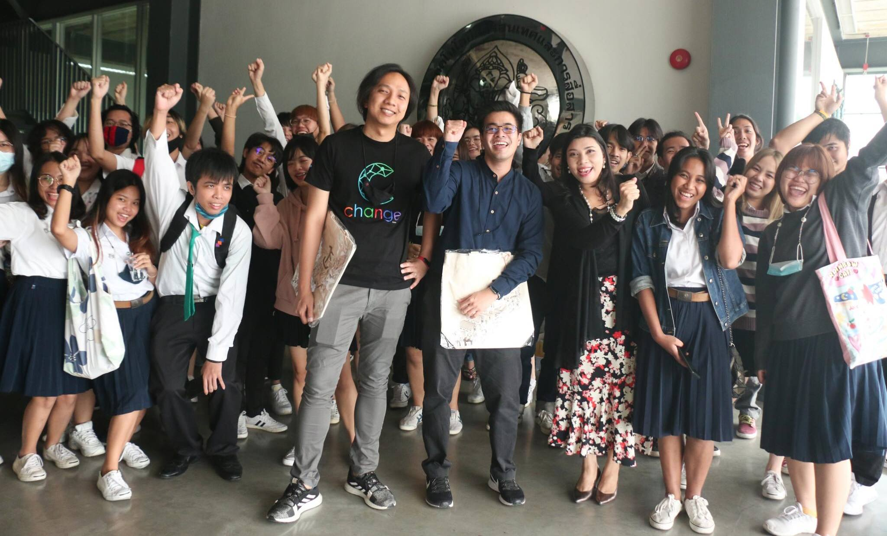

## Security Mechanisms in DBMS (#OperationICTSU10)

+ Date : (Tue) November 17, 2020
+ Venue : [Faculty of Information and Communication Technology, Silpakorn University](https://www.ict.su.ac.th/)

[](https://www.facebook.com/hashtag/OperationICTSU10)

## Contributor[s]
+ Maykin Warasart (เมฆินทร์ วรศาสตร์) [[➳](http://mk.in.th)]
+ Sirisak Ketkaew (ศิริศักดิ์ เกตุแก้ว) [[➳](https://www.facebook.com/sirisak.k94)]

## Attendees
<!--  [[Cert](OperationICTSU10/Attendance/xxx.pdf)] -->
+ Chayisara Khantha (ชยิสรา คันธะ)
+ Nattawut Khonthon (ณัฐวุฒิ คนทน) [[Cert](OperationICTSU10/Attendance/VXOpICTSU10-20201117-Nattawut-Khonthon.pdf)]
+ Nitchakamon Sajan (ณิชกมล แซ่จัน) [[Cert](OperationICTSU10/Attendance/VXOpICTSU10-20201117-Nitchakamon-Sajan.pdf)]
+ Sakpiphat Kedkaew (ศักดิ์พิภัช เกตุแก้ว) [[Cert](OperationICTSU10/Attendance/VXOpICTSU10-20201117-Sakpiphat-Kedkaew.pdf)]
+ Surachet Seehaboot (สุรเชษฐ์ สีหะบุตร) [[Cert](OperationICTSU10/Attendance/VXOpICTSU10-20201117-Surachet-Seehaboot.pdf)]
+ Thananchai Charoenapisak (ธนัญชัย เจริญอภิศักดิ์) [[Cert](OperationICTSU10/Attendance/VXOpICTSU10-20201117-Thananchai-Charoenapisak.pdf)]
+ Tida Yuenyong (ธิดา ยืนยง) [[Cert](OperationICTSU10/Attendance/VXOpICTSU10-20201117-Tida-Yuenyong.pdf)]

```markdown
Let's volunteer to make an impact together!
```

## Become a Supporter

[](https://lin.ee/cnIgUj4)

[](https://line.me/R/ti/p/@voluntex)
[](https://m.me/VolunteXTH)