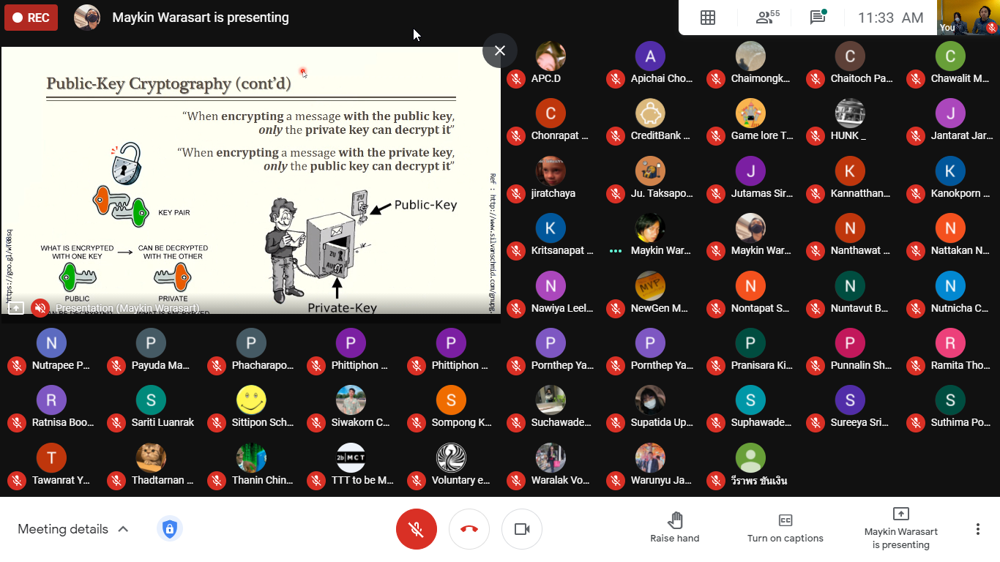
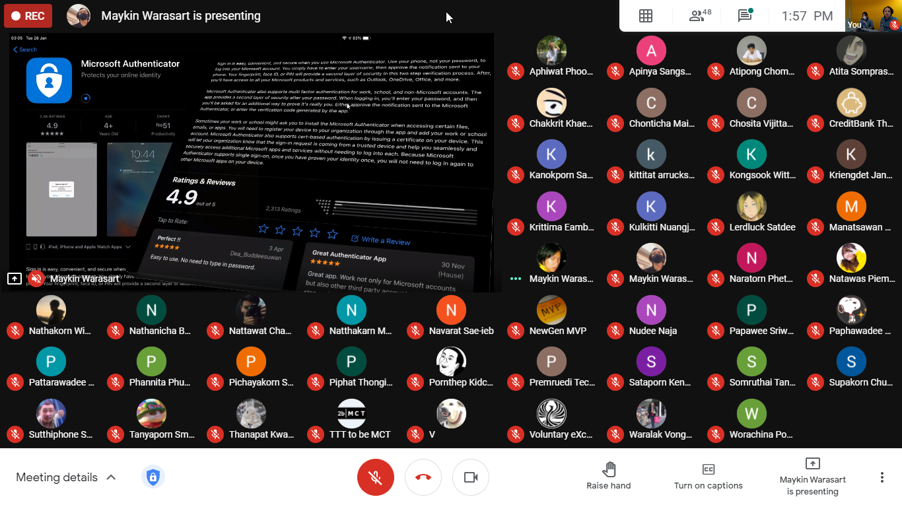
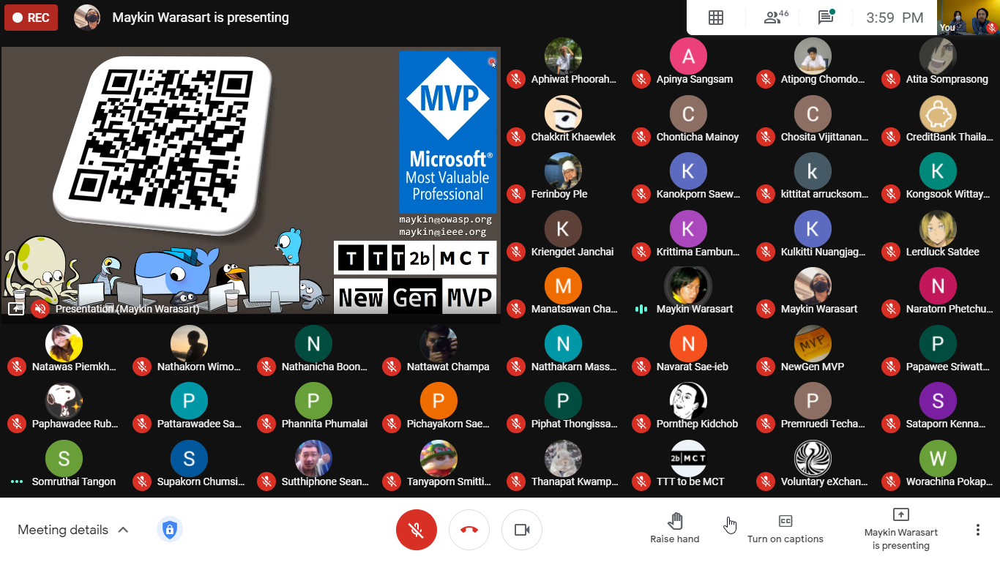

## Getting Started in Cybersecurity (I, AAA) (#OperationICTSU100)

+ Date : (Tue) January 26, 2021
+ Venue : [Faculty of ICT, Silpakorn University](https://www.ict.su.ac.th/) (Virtual Classroom)

[](OperationICTSU100/pic/2021-01-26_104612.png)
[](OperationICTSU100/pic/2021-01-26_113310.png)
[](OperationICTSU100/pic/2021-01-26_135721.png)
[](OperationICTSU100/pic/2021-01-26_155944.png)

## Session
+ AM [](https://drive.google.com/file/d/1Uow_Slk8LDnTD1sWqC-KRH9pBa2f2Qe1)
+ PM [](https://drive.google.com/file/d/1mvcYkmddMy5QLcUmWP1GAtfHKvDhwhos)

## Contributor[s]
+ Maykin Warasart (เมฆินทร์ วรศาสตร์) [[➳](http://mk.in.th)]
+ Suphawadee Charuteeranat (สุภาวดี จารุธีรนาท) [[➳](https://www.facebook.com/thdeemiss03)]

## Attendees
<!--  [[Cert](OperationICTSU100/attendance/xxx.pdf)] -->
+ Apatcha Sonpray (อพัชชา สนพราย)
+ Aphiwat Phoorahong (อภิวัฒน์ ภู่ระหงษ์) [[Cert](OperationICTSU100/attendance/VXOpICTSU100-20210126-Aphiwat-Phoorahong.pdf)]
+ Apichai Chomjun (อภิชัย ชมจันทร์)
+ Apinya Sangsam (อภิญญา สังข์เสม) [[Cert](OperationICTSU100/attendance/VXOpICTSU100-20210126-Apinya-Sangsam.pdf)]
+ Atipong Chomdong (อธิพงศ์ ชมดง) [[Cert](OperationICTSU100/attendance/VXOpICTSU100-20210126-Atipong-Chomdong.pdf)]
+ Atita Somprasong (อทิตา สมประสงค์) [[Cert](OperationICTSU100/attendance/VXOpICTSU100-20210126-Atita-Somprasong.pdf)]
+ Aunniya Vijittanantakul (อันต์ณิญา วิจิตตนันทากุล)
+ Chaimongkhon Srilit (ชัยมงคล ศรีฤทธิ์) [[Cert](OperationICTSU100/attendance/VXOpICTSU100-20210126-Chaimongkhon-Srilit.pdf)]
+ Chaitoch Pansuvan (ชัยธัช ปานสุวรรณ์) [[Cert](OperationICTSU100/attendance/VXOpICTSU100-20210126-Chaitoch-Pansuvan.pdf)]
+ Chakkrit Khaewlek (จักรกฤษณ์ แก้วเล็ก)
+ Chanasorn Sretongtae (ชนสรณ์ ศรีทองแท้)
+ Chawalit Marayat (ชวลิต มารยาท)
+ Chonrapat Settarat (ชนรพัฒน์ เศรษฐรัตน์)
+ Chonticha Mainoy (ชลธิชา ไม่น้อย)
+ Jantarat Jareonsuk (จันทรัสม์ เจริญสุข)
+ Jiratchaya Sutawong (จิรัชญา สุตะวงษ์)
+ Jutamas Siriart (จุฑามาศ ศิริอรรถ)
+ Kannatthanan Biyaem (กันต์ณัฐนันท์ ใบแย้ม)
+ Kanokporn angkasekwinai (กนกพร อังคเศกวินัย)
+ Kanokporn Saewoon (กนกพร แซ่หวุ่น)
+ Kittitat Arrucksomboon (กิตติธัช อารักษ์สมบูรณ์) [[Cert](OperationICTSU100/attendance/VXOpICTSU100-20210126-Kittitat-Arrucksomboon.pdf)]
+ Kongsook Wittayawanitchai (ก้องสุข วิทยาวนิชชัย)
+ Kriengdet Janchai (เกรียงเดช จันทร์ฉาย)
+ Kritsanapat Watcharakriengkrai (กฤษณพัทธ์ วัชระเกรียงไกร)
+ Krittima Eambunnapong (กฤติมา เอี่ยมบรรณพงษ์) [[Cert](OperationICTSU100/attendance/VXOpICTSU100-20210126-Krittima-Eambunnapong.pdf)]
+ Kulkitti Nuangjagoun (กุลกิตติ เนื่องจากอวน)
+ Lerdluk Satdee (เลิศลักษณ์ สาตดี) [[Cert](OperationICTSU100/attendance/VXOpICTSU100-20210126-Lerdluk-Satdee.pdf)]
+ Manatsawan Channarong (มนัสวรรณ ชาญณรงค์)
+ Nanthawat Pinitkijwat (นันทวัฒน์ พินิจกิจวัฒน์)
+ Naratorn Phetchuchat (นราธร เพ็ชรชูชาติ)
+ Natawas Piemkhumdee (ณัฐวัส เปี่ยมขำดี)
+ Nathakorn Wimonwatwethi (ณฐกร วิมลวัตรเวที)
+ Nathanicha Boonyaporn (ณัฏฐณิชา บุณยาภรณ์)
+ Nattakan Noichalad (ณัฐกานต์ น้อยฉลาด) [[Cert](OperationICTSU100/attendance/VXOpICTSU100-20210126-Nattakan-Noichalad.pdf)]
+ Nattawat Champa (ณัฐวรรธน์ จำปา)
+ Natthakarn Massuwan (ณัฐกาญจน์ เมษสุวรรณ) [[Cert](OperationICTSU100/attendance/VXOpICTSU100-20210126-Natthakarn-Massuwan.pdf)]
+ Natthasit Promsorn (ณัฐสิทธิ์ พรมสอน)
+ Navarat Sae-ieb (นวรัตน์ แซ่เอี๊ยบ)
+ Nawiya Leelanawalikhit (นวิญา ลีลานวลิขิต) [[Cert](OperationICTSU100/attendance/VXOpICTSU100-20210126-Nawiya-Leelanawalikhit.pdf)]
+ Nontapat Supanwattanachai (นนทพัทธ์ สุพรรณวัฒนชัย) [[Cert](OperationICTSU100/attendance/VXOpICTSU100-20210126-Nontapat-Supanwattanachai.pdf)]
+ Nuntavut Baongam (นันทวุฒิ บัวงาม)
+ Nuthapong Tungsuk (ณัฐพงศ์ ถึงสุข) [[Cert](OperationICTSU100/attendance/VXOpICTSU100-20210126-Nuthapong-Tungsuk.pdf)]
+ Nutnicha Charoenkul (นัฐณิชา เจริญกุล)
+ Nutrapee Phundech (นัฐระพี พันเดช)
+ Pakawat Jundapram (ภควัต จันดาเปรม)
+ Papawee Sriwattana (ปภาวี ศรีวัฒนา)  [[Cert](OperationICTSU100/attendance/VXOpICTSU100-20210126-Papawee-Sriwattana.pdf)]
+ Paphawadee Rubsung (ปภาวดี รูปสูง)
+ Pattarawadee Saebae (ภัทรวดี แซ่เบ้) [[Cert](OperationICTSU100/attendance/VXOpICTSU100-20210126-Pattarawadee-Saebae.pdf)]
+ Payuda Makpasuk (ปยุดา มากผาสุข)
+ Phacharapon Pakchuen (พัชรพล ภักตรชื่น) [[Cert](OperationICTSU100/attendance/VXOpICTSU100-20210126-Phacharapon-Pakchuen.pdf)]
+ Phannita Phumalai (พรรนนิตา ภู่มาลัย)
+ Phittiphon Wangburapapaiboon (พิตติพล หวังบูรพาไพบูลย์)
+ Pichayakorn Saenatham (พิชญากรณ์ เสนาธรรม) [[Cert](OperationICTSU100/attendance/VXOpICTSU100-20210126-Pichayakorn-Saenatham.pdf)]
+ Piphat Thongissara (พิพัฒน์ ทองอิสสระ)
+ Pornthep Kidchob (พรเทพ คิดชอบ)
+ Pornthep Yangsomboon (พรเทพ ยางสมบูรณ์)
+ Pranisara Kijnate (ปาณิสรา กิจเนตร์)
+ Premruedi Techaaphichit (เปรมฤดี เตชอภิชิต) [[Cert](OperationICTSU100/attendance/VXOpICTSU100-20210126-Premruedi-Techaaphichit.pdf)]
+ Punnalin Shutrashata (ปัณณลิน ฉัฏฐ์รชฏ) [[Cert](OperationICTSU100/attendance/VXOpICTSU100-20210126-Punnalin-Shutrashata.pdf)]
+ Rachanon Suanma (รชานนท์ สวนมา)
+ Ramita Thongdonam (รมิตา ทองดอนอ่ำ) [[Cert](OperationICTSU100/attendance/VXOpICTSU100-20210126-Ramita-Thongdonam.pdf)]
+ Ratnisa Boonhenglee (รัตน์นิศา บุ้นเฮงหลี) [[Cert](OperationICTSU100/attendance/VXOpICTSU100-20210126-Ratnisa-Boonhenglee.pdf)]
+ Sariti Luanrak (ศริติ ล่วนรักษ์)
+ Sataporn Kennamthieng (สถาพร เคนน้ำเที่ยง)
+ Sirindhorn Khola (ศิรินธร คอล้า)
+ Sittipon Schrott (สิทธิพล ชร็อตต์)
+ Siwakorn Chansomboon (ศิวกร จันทร์สมบูรณ์)
+ Sompong Khunthamsiri (สมพงษ์ คุณธรรมสิริ) 
+ Somruthai Tangon (สมฤทัย แตงอ่อน)
+ Suchawadee Yuedyaow (สุชาวดี ยืดยาว) 
+ Supakorn Chumsing (ศุภกร ชุมสิงห์) 
+ Supatida Upan (สุภธิดา อุปัญญ์)
+ Sureeya Sriuschariya (สุรีย์ญา ศรีอัจฉริยะ) 
+ Suthima poonsiripipat (สุธิมา พูนศิริพิพัฒน์)
+ Sutthiphon Saengnum (สุทธิพร แสงนุ่ม)
+ Taksaporn Sinsongserm (ทักษพร สินส่งเสริม) 
+ Tanyaporn Smittikorakul (ธัญพร สมิทธิกรกุล)
+ Tawanrat Yensook (ธวัลรัตน์ เย็นสุข) [[Cert](OperationICTSU100/attendance/VXOpICTSU100-20210126-Tawanrat-Yensook.pdf)]
+ Thadtarnan Sangjitpondchok (ทัตธนันท์ สังข์จิตพรโชค)
+ Thanapat Kwampean (ธนภัทร ความเพียร) [[Cert](OperationICTSU100/attendance/VXOpICTSU100-20210126-Thanapat-Kwampean.pdf)]
+ Thanin Chinwattanakarn (ธนิน ชินวัฒนกาญจน์) [[Cert](OperationICTSU100/attendance/VXOpICTSU100-20210126-Thanin-Chinwattanakarn.pdf)]
+ Varat Tanawatchwarapanya (วรัท ธนวัชร์วรปัญญา)
+ Warachina Pokapanich (วรชินา โภคาพานิชย์)
+ Warunyu Jantree (วรัญญู จันทร์ตรี)
+ Wiraphon Khanngoen (วีราพร ขันเงิน)

```markdown
Let's volunteer to make an impact together!
```

## Become a Supporter

[](https://lin.ee/cnIgUj4)

[](https://line.me/R/ti/p/@voluntex)
[](https://m.me/VolunteXTH)