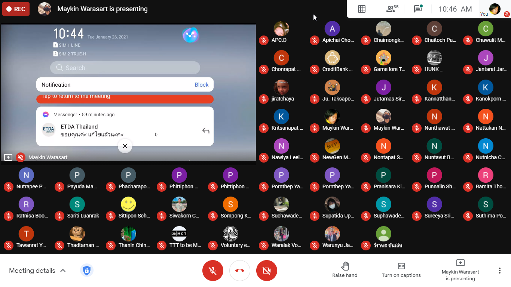

## Getting Started in Cybersecurity (I, AAA) (#OperationICTSU100)

+ Date : (Tue) January 26, 2021
+ Venue : [Faculty of ICT, Silpakorn University](https://www.ict.su.ac.th/) (Virtual Classroom)

[](OperationICTSU100/pic/2021-01-26_104612.png)
[](OperationICTSU100/pic/2021-01-26_113310.png)
[](OperationICTSU100/pic/2021-01-26_135721.png)
[](OperationICTSU100/pic/2021-01-26_155944.png)

## Session
+ AM [](https://drive.google.com/file/d/1Uow_Slk8LDnTD1sWqC-KRH9pBa2f2Qe1) <!-- https://youtu.be/-t7PyEWHgQU -->
+ PM [](https://drive.google.com/file/d/1mvcYkmddMy5QLcUmWP1GAtfHKvDhwhos) <!-- https://youtu.be/DX4Eu_p1pr0 -->

## Contributor[s]
+ Maykin Warasart (เมฆินทร์ วรศาสตร์) [[➳](http://mk.in.th)]
+ Suphawadee Charuteeranat (สุภาวดี จารุธีรนาท) [[➳](https://www.facebook.com/thdeemiss03)]

## Attendees
<!--  [[Cert](OperationICTSU100/attendance/xxx.pdf)] -->
1. Apatcha Sonpray (อพัชชา สนพราย)
1. Aphiwat Phoorahong (อภิวัฒน์ ภู่ระหงษ์) [[Cert](OperationICTSU100/attendance/VXOpICTSU100-20210126-Aphiwat-Phoorahong.pdf)]
1. Apichai Chomjun (อภิชัย ชมจันทร์)
1. Apinya Sangsam (อภิญญา สังข์เสม) [[Cert](OperationICTSU100/attendance/VXOpICTSU100-20210126-Apinya-Sangsam.pdf)]
1. Atipong Chomdong (อธิพงศ์ ชมดง) [[Cert](OperationICTSU100/attendance/VXOpICTSU100-20210126-Atipong-Chomdong.pdf)]
1. Atita Somprasong (อทิตา สมประสงค์) [[Cert](OperationICTSU100/attendance/VXOpICTSU100-20210126-Atita-Somprasong.pdf)]
1. Aunniya Vijittanantakul (อันต์ณิญา วิจิตตนันทากุล)
1. Chaimongkhon Srilit (ชัยมงคล ศรีฤทธิ์) [[Cert](OperationICTSU100/attendance/VXOpICTSU100-20210126-Chaimongkhon-Srilit.pdf)]
1. Chaitoch Pansuvan (ชัยธัช ปานสุวรรณ์) [[Cert](OperationICTSU100/attendance/VXOpICTSU100-20210126-Chaitoch-Pansuvan.pdf)]
1. Chakkrit Khaewlek (จักรกฤษณ์ แก้วเล็ก)
1. Chanasorn Sretongtae (ชนสรณ์ ศรีทองแท้)
1. Chawalit Marayat (ชวลิต มารยาท)
1. Chonrapat Settarat (ชนรพัฒน์ เศรษฐรัตน์)
1. Chonticha Mainoy (ชลธิชา ไม่น้อย)
1. Jantarat Jareonsuk (จันทรัสม์ เจริญสุข)
1. Jiratchaya Sutawong (จิรัชญา สุตะวงษ์)
1. Jutamas Siriart (จุฑามาศ ศิริอรรถ)
1. Kannatthanan Biyaem (กันต์ณัฐนันท์ ใบแย้ม)
1. Kanokporn angkasekwinai (กนกพร อังคเศกวินัย)
1. Kanokporn Saewoon (กนกพร แซ่หวุ่น)
1. Kittitat Arrucksomboon (กิตติธัช อารักษ์สมบูรณ์) [[Cert](OperationICTSU100/attendance/VXOpICTSU100-20210126-Kittitat-Arrucksomboon.pdf)]
1. Kongsook Wittayawanitchai (ก้องสุข วิทยาวนิชชัย)
1. Kriengdet Janchai (เกรียงเดช จันทร์ฉาย)
1. Kritsanapat Watcharakriengkrai (กฤษณพัทธ์ วัชระเกรียงไกร)
1. Krittima Eambunnapong (กฤติมา เอี่ยมบรรณพงษ์) [[Cert](OperationICTSU100/attendance/VXOpICTSU100-20210126-Krittima-Eambunnapong.pdf)]
1. Kulkitti Nuangjagoun (กุลกิตติ เนื่องจากอวน) [[Cert](OperationICTSU100/attendance/VXOpICTSU100-20210126-Kulkitti-Nuangjagoun.pdf)]
1. Lerdluk Satdee (เลิศลักษณ์ สาตดี) [[Cert](OperationICTSU100/attendance/VXOpICTSU100-20210126-Lerdluk-Satdee.pdf)]
1. Manatsawan Channarong (มนัสวรรณ ชาญณรงค์)
1. Nanthawat Pinitkijwat (นันทวัฒน์ พินิจกิจวัฒน์)
1. Naratorn Phetchuchat (นราธร เพ็ชรชูชาติ)
1. Natawas Piemkhumdee (ณัฐวัส เปี่ยมขำดี)
1. Nathakorn Wimonwatwethi (ณฐกร วิมลวัตรเวที)
1. Nathanicha Boonyaporn (ณัฏฐณิชา บุณยาภรณ์)
1. Nattakan Noichalad (ณัฐกานต์ น้อยฉลาด) [[Cert](OperationICTSU100/attendance/VXOpICTSU100-20210126-Nattakan-Noichalad.pdf)]
1. Nattawat Champa (ณัฐวรรธน์ จำปา)
1. Natthakarn Massuwan (ณัฐกาญจน์ เมษสุวรรณ) [[Cert](OperationICTSU100/attendance/VXOpICTSU100-20210126-Natthakarn-Massuwan.pdf)]
1. Natthasit Promsorn (ณัฐสิทธิ์ พรมสอน)
1. Navarat Sae-ieb (นวรัตน์ แซ่เอี๊ยบ) [[Cert](OperationICTSU100/attendance/VXOpICTSU100-20210126-Navarat-Sae-ieb.pdf)]
1. Nawiya Leelanawalikhit (นวิญา ลีลานวลิขิต) [[Cert](OperationICTSU100/attendance/VXOpICTSU100-20210126-Nawiya-Leelanawalikhit.pdf)]
1. Nontapat Supanwattanachai (นนทพัทธ์ สุพรรณวัฒนชัย) [[Cert](OperationICTSU100/attendance/VXOpICTSU100-20210126-Nontapat-Supanwattanachai.pdf)]
1. Nuntavut Baongam (นันทวุฒิ บัวงาม)
1. Nuthapong Tungsuk (ณัฐพงศ์ ถึงสุข) [[Cert](OperationICTSU100/attendance/VXOpICTSU100-20210126-Nuthapong-Tungsuk.pdf)]
1. Nutnicha Charoenkul (นัฐณิชา เจริญกุล)
1. Nutrapee Phundech (นัฐระพี พันเดช)
1. Pakawat Jundapram (ภควัต จันดาเปรม)
1. Papawee Sriwattana (ปภาวี ศรีวัฒนา)  [[Cert](OperationICTSU100/attendance/VXOpICTSU100-20210126-Papawee-Sriwattana.pdf)]
1. Paphawadee Rubsung (ปภาวดี รูปสูง)
1. Pattarawadee Saebae (ภัทรวดี แซ่เบ้) [[Cert](OperationICTSU100/attendance/VXOpICTSU100-20210126-Pattarawadee-Saebae.pdf)]
1. Payuda Makpasuk (ปยุดา มากผาสุข)
1. Phacharapon Pakchuen (พัชรพล ภักตรชื่น) [[Cert](OperationICTSU100/attendance/VXOpICTSU100-20210126-Phacharapon-Pakchuen.pdf)]
1. Phannita Phumalai (พรรนนิตา ภู่มาลัย)
1. Phittiphon Wangburapapaiboon (พิตติพล หวังบูรพาไพบูลย์)
1. Pichayakorn Saenatham (พิชญากรณ์ เสนาธรรม) [[Cert](OperationICTSU100/attendance/VXOpICTSU100-20210126-Pichayakorn-Saenatham.pdf)]
1. Piphat Thongissara (พิพัฒน์ ทองอิสสระ)
1. Pornthep Kidchob (พรเทพ คิดชอบ)
1. Pornthep Yangsomboon (พรเทพ ยางสมบูรณ์)
1. Pranisara Kijnate (ปาณิสรา กิจเนตร์)
1. Premruedi Techaaphichit (เปรมฤดี เตชอภิชิต) [[Cert](OperationICTSU100/attendance/VXOpICTSU100-20210126-Premruedi-Techaaphichit.pdf)]
1. Punnalin Shutrashata (ปัณณลิน ฉัฏฐ์รชฏ) [[Cert](OperationICTSU100/attendance/VXOpICTSU100-20210126-Punnalin-Shutrashata.pdf)]
1. Rachanon Suanma (รชานนท์ สวนมา)
1. Ramita Thongdonam (รมิตา ทองดอนอ่ำ) [[Cert](OperationICTSU100/attendance/VXOpICTSU100-20210126-Ramita-Thongdonam.pdf)]
1. Ratnisa Boonhenglee (รัตน์นิศา บุ้นเฮงหลี) [[Cert](OperationICTSU100/attendance/VXOpICTSU100-20210126-Ratnisa-Boonhenglee.pdf)]
1. Sariti Luanrak (ศริติ ล่วนรักษ์)
1. Sataporn Kennamthieng (สถาพร เคนน้ำเที่ยง)
1. Sirindhorn Khola (ศิรินธร คอล้า)
1. Sittipon Schrott (สิทธิพล ชร็อตต์)
1. Siwakorn Chansomboon (ศิวกร จันทร์สมบูรณ์)
1. Sompong Khunthamsiri (สมพงษ์ คุณธรรมสิริ) 
1. Somruthai Tangon (สมฤทัย แตงอ่อน)
1. Suchawadee Yuedyaow (สุชาวดี ยืดยาว) 
1. Supakorn Chumsing (ศุภกร ชุมสิงห์) 
1. Supatida Upan (สุภธิดา อุปัญญ์)
1. Sureeya Sriuschariya (สุรีย์ญา ศรีอัจฉริยะ) 
1. Suthima poonsiripipat (สุธิมา พูนศิริพิพัฒน์)
1. Sutthiphon Saengnum (สุทธิพร แสงนุ่ม)
1. Taksaporn Sinsongserm (ทักษพร สินส่งเสริม) 
1. Tanyaporn Smittikorakul (ธัญพร สมิทธิกรกุล)
1. Tawanrat Yensook (ธวัลรัตน์ เย็นสุข) [[Cert](OperationICTSU100/attendance/VXOpICTSU100-20210126-Tawanrat-Yensook.pdf)]
1. Thadtarnan Sangjitpondchok (ทัตธนันท์ สังข์จิตพรโชค)
1. Thanapat Kwampean (ธนภัทร ความเพียร) [[Cert](OperationICTSU100/attendance/VXOpICTSU100-20210126-Thanapat-Kwampean.pdf)]
1. Thanin Chinwattanakarn (ธนิน ชินวัฒนกาญจน์) [[Cert](OperationICTSU100/attendance/VXOpICTSU100-20210126-Thanin-Chinwattanakarn.pdf)]
1. Varat Tanawatchwarapanya (วรัท ธนวัชร์วรปัญญา)
1. Warachina Pokapanich (วรชินา โภคาพานิชย์)
1. Warunyu Jantree (วรัญญู จันทร์ตรี)
1. Wiraphon Khanngoen (วีราพร ขันเงิน)

```markdown
Let's volunteer to make an impact together!
```

## Become a Supporter

[](https://lin.ee/cnIgUj4)

[](https://line.me/R/ti/p/@voluntex)
[](https://m.me/VolunteXTH)