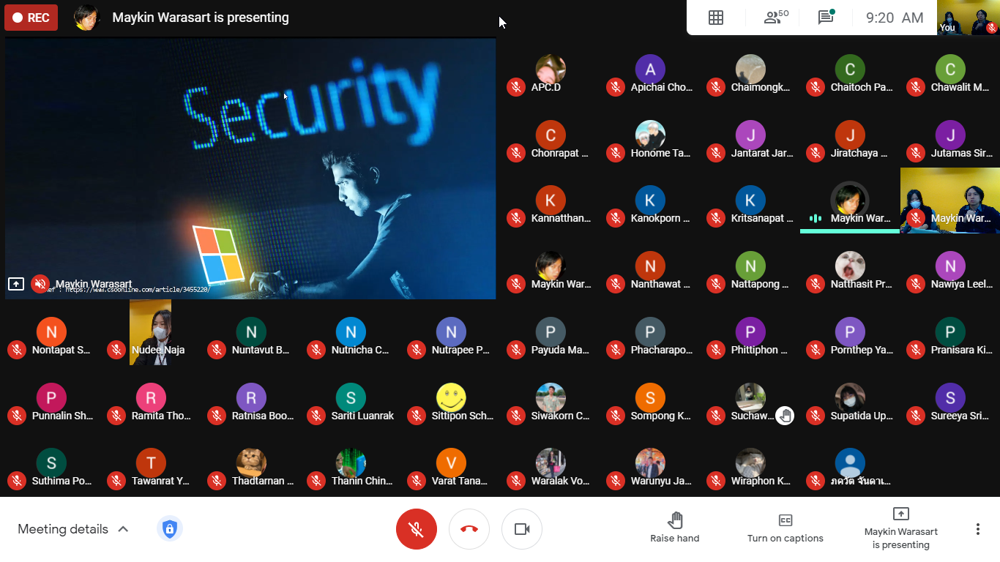
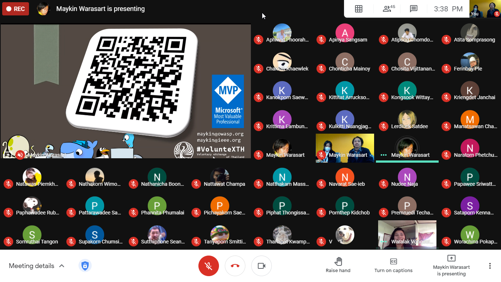

## Getting Started in Cybersecurity (CIA) (#OperationICTSU11)

+ Date : (Tue) January 19, 2021
+ Venue : [Faculty of ICT, Silpakorn University](https://www.ict.su.ac.th/) (Virtual Classroom)

[](OperationICTSU11/pic/2021-01-19_092057.png)
[](OperationICTSU11/pic/2021-01-19_153833.png)

## Session
+ AM [](https://drive.google.com/file/d/1WIBS7C9WjLMUPKi6UnHyJyvzb07-YMP_)
+ PM [](https://drive.google.com/file/d/1S9Hxg1JAsBQquqYmnh8LM6dtSGJ8N6CZ)

## Contributor[s]
+ Maykin Warasart (เมฆินทร์ วรศาสตร์) [[➳](http://mk.in.th)]
+ Suphawadee Charuteeranat (สุภาวดี จารุธีรนาท) [[➳](https://www.facebook.com/thdeemiss03)]

## Attendees
<!--  [[Cert](OperationICTSU11/attendance/xxx.pdf)] -->
+ John Doe (จอห์น โด) [[Cert](OperationICTSU11/attendance/VXOpICTSU11-20210119-John-Doe.pdf)]
1. Apatcha Sonpray (อพัชชา สนพราย)
1. Apichai Chomjun (อภิชัย ชมจันทร์)
1. Chaimongkhon Srilit (ชัยมงคล ศรีฤทธิ์)
1. Chaitoch Pansuvan (ชัยธัช ปานสุวรรณ์)
1. Chanasorn Sretongtae (ชนสรณ์ ศรีทองแท้)
1. Chawalit Marayat (ชวลิต มารยาท)
1. Chonrapat Settarat (ชนรพัฒน์ เศรษฐรัตน์)
1. Jantarat Jareonsuk (จันทรัสม์ เจริญสุข)
1. Jiratchaya Sutawong (จิรัชญา สุตะวงษ์)
1. Jutamas Siriart (จุฑามาศ ศิริอรรถ)
1. Kannatthanan Biyaem (กันต์ณัฐนันท์ ใบแย้ม)
1. Kanokporn angkasekwinai (กนกพร อังคเศกวินัย)
1. Kritsanapat Watcharakriengkrai (กฤษณพัทธ์ วัชระเกรียงไกร)
1. Nanthawat Pinitkijwat (นันทวัฒน์ พินิจกิจวัฒน์)
1. Nattakan Noichalad (ณัฐกานต์ น้อยฉลาด)
1. Natthasit Promsorn (ณัฐสิทธิ์ พรมสอน)
1. Nawiya Leelanawalikhit (นวิญา ลีลานวลิขิต)
1. Nontapat Supanwattanachai (นนทพัทธ์ สุพรรณวัฒนชัย)
1. Nuntavut Baongam (นันทวุฒิ บัวงาม)
1. Nuthapong Tungsuk (ณัฐพงศ์ ถึงสุข)
1. Nutnicha Charoenkul (นัฐณิชา เจริญกุล)
1. Nutrapee Phundech (นัฐระพี พันเดช)
1. Payuda Makpasuk (ปยุดา มากผาสุข)
1. Phacharapon Pakchuen (พัชรพล ภักตรชื่น)
1. Phittiphon Wangburapapaiboon (พิตติพล หวังบูรพาไพบูลย์)
1. Pranisara Kijnate (ปาณิสรา กิจเนตร์)
1. Punnalin Shutrashata (ปัณณลิน ฉัฏฐ์รชฏ)
1. Rachanon Suanma (รชานนท์ สวนมา)
1. Ramita Thongdonam (รมิตา ทองดอนอ่ำ)
1. Ratnisa boonhenglee (รัตน์นิศา บุ้นเฮงหลี)
1. Sariti Luanrak (ศริติ ล่วนรักษ์)
1. Sittipon Schrott (สิทธิพล ชร็อตต์)
1. Siwakorn Chansomboon (ศิวกร จันทร์สมบูรณ์)
1. Sompong Khunthamsiri (สมพงษ์ คุณธรรมสิริ)
1. Suchawadee Yuedyaow (สุชาวดี ยืดยาว)
1. Supatida Upan (สุภธิดา อุปัญญ์)
1. Sureeya Sriuschariya (สุรีย์ญา ศรีอัจฉริยะ)
1. Suthima poonsiripipat (สุธิมา พูนศิริพิพัฒน์)
1. Taksaporn Sinsongserm (ทักษพร สินส่งเสริม)
1. Tawanrat Yensook (ธวัลรัตน์ เย็นสุข)
1. Thadtarnan Sangjitpondchok (ทัตธนันท์ สังข์จิตพรโชค)
1. Thanin Chinwattanakarn (ธนิน ชินวัฒนกาญจน์)
1. Varat Tanawatchwarapanya (วรัท ธนวัชร์วรปัญญา)
1. Warunyu Jantree (วรัญญู จันทร์ตรี)
1. Wiraphon Khanngoen (วีราพร ขันเงิน)


```markdown
Let's volunteer to make an impact together!
```

## Become a Supporter

[](https://lin.ee/cnIgUj4)

[](https://line.me/R/ti/p/@voluntex)
[](https://m.me/VolunteXTH)