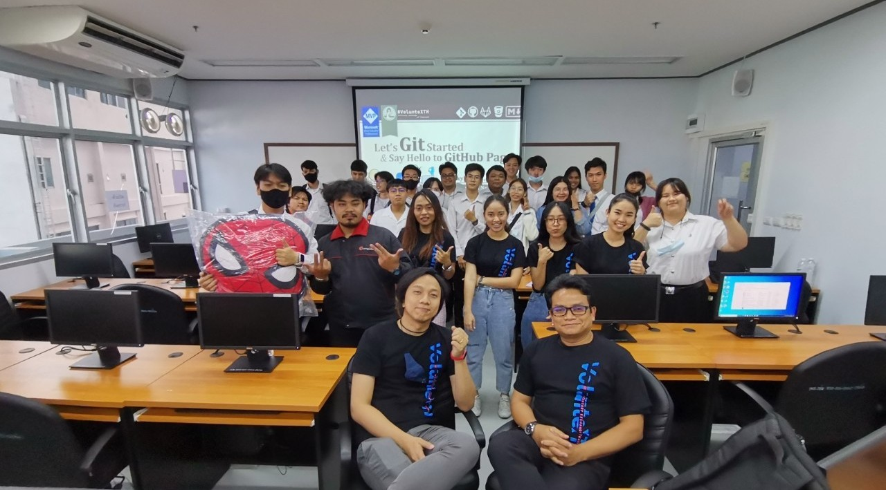

## Fun with #Git (#OperationRMUTTO)

+ Date : [(Fri) November 27, 2020](https://www.facebook.com/permalink.php?story_fbid=3780036865392841&id=872051316191425))
+ Venue : [Faculty of Business Administration and Information Technology, RMUTTO](https://busit.rmutto.ac.th/)

[](https://www.facebook.com/hashtag/OperationRMUTTO)
[](https://www.facebook.com/hashtag/OperationRMUTTO)

## Contributor[s]
1. Sakchai Chaiyarak (ศักดิ์ชัย ไชยรักษ์) [[➳](https://www.facebook.com/chaiyaraks)]
1. Siwaporn Linthaluek (ศิวพร ลินทะลึก) [[➳](https://www.facebook.com/LoVeNoMoErTeAr)]
1. [Naphatsanan Suwannawong (นภัสนันท์ สุวรรณวงศ์)](contributor/VXOpRMUTTO-20201127-Naphatsanan-Suwannawong.pdf) [[➳](https://www.facebook.com/benzii.mda)]
1. Paparat Sillapasuwan (ปภารัตน์ ศิลปสุวรรณ) [[➳](https://www.facebook.com/Parn.scoopydoo)]
1. Jidapha Yoorubsuk (จิดาภา อยู่รับสุข) [[➳](https://www.facebook.com/Aomylette)]

## Operation Enabler & Facilitator
+ Tippawan Meepung (อ.ทิพวรรณ มีพึ่ง) [[➳](https://www.facebook.com/mfktsoft)]

## Operation Leader
+ Maykin Warasart (เมฆินทร์ วรศาสตร์) [[➳](http://mk.in.th)]

## Attendees
1. Chaetsada Saenking (เจษฎา แสนกิ่ง)
1. Chanatip Suravuttivichai (ชนาธิป สุรวุฒิวิชัย)
1. Charhutpat Sillapasombat (จรัสพัฒน์ ศิลปสมบัติ)
1. Chayanin Chombunchawy (ชญานิน ชมบุญช่วย)
1. Jinnawat Kitteng (จิณณวัตร กิจเต็ง)
1. Jiraphat Tesphan (จิรภัทร เทศพันธ์)
1. Jirayut Supon (จิรายุทธ สุพล) [[Cert](attendance/VXOpRMUTTO-20201127-Jirayut-Supon.pdf)]
1. Kamet Buathip (คเณศ บัวทิพย์)
1. Kittituch Parjanban (กิตติธัช ประจันบาล)
1. Manthana Thabfaeng (มัณฑนา ทับแฟง) [[Cert](attendance/VXOpRMUTTO-20201127-Manthana-Thabfaeng.pdf)]
1. Methee Thongniam (เมธี ทองเนียม)
1. Nathamon Viroj (ณฐมน วิโรจน์)
1. Nattakit Ratngampradit (ณัฐกิตต์ รัตน์งามประดิษฐ์)
1. Nattaphon Premkit (นัฐพล เปรมกิจ)
1. Nattaphum Puangpom (ณัฏฐภูมิ พ่วงป้อม)
1. Nuttawat Chatphuak (ณัฐวัฒน์ ชาติเผือก)
1. Panumas Khantiwong (ภาณุมาศ ขันติวงศ์) [[Cert](attendance/VXOpRMUTTO-20201127-Panumas-Khantiwong.pdf)]
1. Panuvit Sangsri (ภาณุวิชญ์ แสงศรี)
1. Panuwat Ketsuwan (ภานุวัฒน์ เกตุสุวรรณ์)
1. Passakon Promma (ภาสกร พรมมา) [[Cert](attendance/VXOpRMUTTO-20201127-Passakon-Promma.pdf)]
1. Patipan Chotbowornsit (ปฏิภาณ โชติบวรสิทธิ์)
1. Pattadon Leekmake (พัทธดนธ์ หลีกเมฆ)
1. Pattharaporn Matimang (ภัทราภรณ์ มาธิมัง)
1. Phatthanaphon Chuysurichay (พัฒนพล ฉุยสุริฉาย)
1. Pichayudtm Sukhanon (พิชญุตม์ สุขานนท์) [[Cert](attendance/VXOpRMUTTO-20201127-Pichayudtm-Sukhanon.pdf)]
1. Pitchanon Kamrai (พิชชานนท์ กำไร)
1. Pongsakorn Khumphis (พงศกร ขำพิศ) [[Cert](attendance/VXOpRMUTTO-20201127-Pongsakorn-Khumphis.pdf)]
1. Poomin Warakanjanapong (ภูมินทร์ วีระกาญจนพงษ์)
1. Ratchadaphorn Khumsri (รัชฎาพร คำศรี)
1. Ratchakit Woraphinyophat (รัชกฤช วรภิญโญภาส)
1. Rujirut Poonsawas (รุจิรัตน์ พูลสวัสดิ์) [[Cert](attendance/VXOpRMUTTO-20201127-Rujirut-Poonsawas.pdf)]
1. Saharat Sangdara (สหรัฐ แสงดารา)
1. Sarocha Dounglomchan (สโรชา ดวงล้อมจันทร์)
1. Sipakorn Sakonsukon (สิปกร สาครสุคนธ์)
1. Siranee Bunloet (ศิราณี บุญเลิศ)
1. Sitichok Hompungpoo (สิทธิโชค หอมพวงภู่)
1. Sitthisak Budsarakhamkul (สิทธิศักดิ์ บุษราคัมกุล)
1. Siwamok Magkhamarn (ศิวโมกข์ มัฆมาน)
1. Supanida Boonphong (สุภนิดา บุญผ่อง)
1. Thadapong Nakdirok (ธาดาพงศ์ นาคดิลก)
1. Thanapat Pewdamkam (ธนภัทร ผิวดำขำ)
1. Theerapon Sanmai (ธีรพล แสนใหม่)
1. Thipbode Sukyag (ธิบดี สุขญาติ)
1. Thitima Chuenjinda (ฐิติมา ชื่นจินดา)

## Official Sponsor
[](https://www.facebook.com/hashtag/NewGenMVP)
[](https://www.facebook.com/hashtag/TTT2bMCT)

```markdown
Let's volunteer to make an impact together!
```

## Become a Supporter

[](https://lin.ee/cnIgUj4)

[](https://line.me/R/ti/p/@voluntex)
[](https://m.me/VolunteXTH)

## Pre-requisite
+ [https://git-scm.com/download/](https://git-scm.com/download/)
+ [https://desktop.github.com/](https://desktop.github.com/)
+ [https://www.python.org/downloads/](https://www.python.org/downloads/)
+ [https://code.visualstudio.com/download](https://code.visualstudio.com/download)